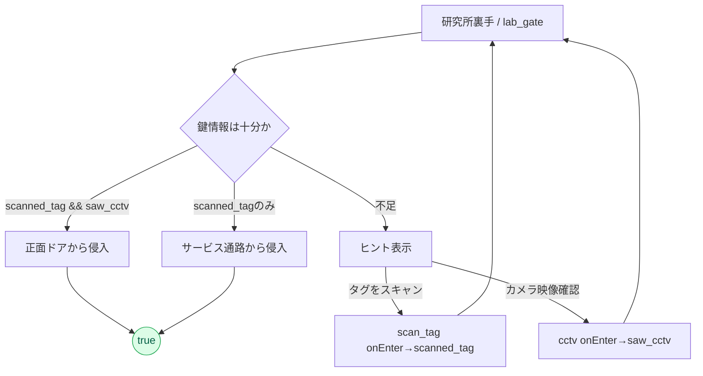

# テキストアドベンチャーゲーム 要件定義書

## プロジェクト概要

### ゲームタイトル
「失踪猫イレブンの謎」

### コンセプト
現代日本の千葉県浦安市を舞台にした、猫を探すという目的から様々なストーリーに派生するテキストアドベンチャーゲーム。「かまいたちの夜」のような分岐型ストーリーで、15種類の異なるエンディングを楽しめる。

### 目標
- 物語重視のゲーム体験：ストーリー展開やキャラクターの心情描写に重点
- 謎解きの楽しさ：論理的思考力を使った謎解きが多く、知的好奇心を満たす
- 多彩なエンディング：選択肢によって分岐するストーリーと複数のエンディング

## ゲーム仕様

### プレイ時間
- 想定プレイ時間：10分～15分（1回のプレイ）
- 全エンディングクリアまで：複数回プレイが必要

### プラットフォーム
- 配布方法：GitHub Pages
- 対応ブラウザ：Chrome（推奨）
- 実装形式：静的HTML/CSS/JavaScript

## ストーリー設定

### 世界観
- 時代：現代の日本
- 舞台：千葉県浦安市の住宅街
- 主人公の住居：マンション1階

### メインストーリー
近所の友人から「猫を探して欲しいんだ。3日以内に」という依頼を受け、逃げた猫「イレブン」を探すことから物語が始まる。

### 猫「イレブン」の設定
- 特徴：眉間に11のような色がついている
- 正体：量産実験で作られたクローン猫
- 逃げた原因：一定年齢になると帰巣本能が働き、研究所に帰るように仕組まれていた

## キャラクター設定

### 主人公
- **イチ**：穏やかで熟慮するタイプの双子の片割れ
- **ナナ**：活発で頭の回転が速いタイプの双子の片割れ
- 年齢：高校2年生
- 関係性：仲が良い双子
- 操作：両方を操作可能

### サポートキャラクター
- **友人**：イレブンの飼い主、別の高校に通っている
- **その他**：ルートとエンディングに応じて追加キャラクターを用意

## エンディング設計

### エンディング一覧（全15種類）

#### トゥルーエンド（1種類）
- **真実の結末**：猫を無事見つけ、逃げた原因も解明、陰謀を暴く

#### ハッピーエンド（4種類）
1. **普通の発見**：猫は見つかるが、逃げた原因はわからないまま
2. **太った猫の帰還**：猫が勝手に帰ってくるがものすごい太っている、逃げた原因はわからないまま
3. **子猫連れ**：猫が勝手に帰ってくるが子猫を5匹連れてくる
4. **海外発見**：猫を海外で見つける、逃げた原因はわからないまま

#### バッドエンド（3種類）
1. **見つからない**：猫が見つからない
2. **変質した猫**：猫は見つかるが、性格が変わってしまっており、違う猫なんじゃないかと不穏な感じで終わる
3. **再び逃げる**：猫は見つかるが、途中で逃がしてしまう

#### 不思議なエンド（7種類）
1. **そして大阪へ**：途中で漫才風な流れになり、そのまま大阪へ
2. **機械の猫**：猫の正体に機械仕掛けの秘密が関わってくる
3. **友人の罠**：依頼の裏に仕掛けられた罠に気づく
4. **強敵を求めて**：探索の末に強敵と対峙し、物語は別の方向へ
5. **地下迷宮**：地下で出口のない迷路を彷徨う
6. **タイムリープ**：ある出来事をきっかけに時間が巻き戻るような感覚へ
7. **派閥争い**：医療をめぐる派閥の渦中に飛び込む

## ゲームシステム

### 選択肢システム
- **会話選択肢**：キャラクターとの対話における選択
- **行動選択肢**：どこに行く、何をするかの選択
- **謎解き選択肢**：論理的な推理や推測による選択

### 分岐システム
- **冒頭から分岐**：物語の最初から選択肢が発生
- **要所要所で分岐**：シーンごとに選択肢が現れる
- **枝分かれ構造**：選択によって異なるルートに進む

### エンディング連鎖システム
- **選択肢の追加**：エンディングを見るごとに新しいシーンやルートが追加
- **不思議エンドの段階開放**：既読数に応じて不思議ルートを解禁（0→0、1→3、3→5、5→7）。未解禁の不思議ルートは選択肢自体を非表示。
- **データ保持**：ローカルストレージでエンディング既読状況を管理

### 謎解きシステム
- **難易度**：冒頭は初心者向け、終盤で中級者向け
- **種類**：暗号解読、論理パズル、推理（ルートによって変化）
- **ヒントシステム**：失敗したらヒントの選択肢が増える
  - 例：研究所入口（電子錠）では「タグのスキャン」「防犯カメラ確認」などの手掛かりフラグ（`scanned_tag`/`saw_cctv`）で通過ルートが段階開放。未達時はヒントを表示。

## 技術仕様

### データ管理
- **セーブ機能**：あり
- **データ保存**：ローカルストレージで管理
- **クリア判定**：エンディング画面（エンディングのテキスト）まで到達したらクリアと判定
 - **既読フラグ**：`endingsSeen` にエンディングIDを記録。UIの解禁や図鑑に利用。

### UI/UX設計
- **選択肢表示**：指で押しやすいボタン形式
- **戻る機能**：なし
- **操作方法**：マウスクリック（指でタッチ）で遷移
 - **ヘッダー**：既読数表示（5件以上でクリック可能なリンク化）／右上に「データ削除」ボタン
 - **エンディング画面**：見出しを「Ending：<ID>」で表示。種別（トゥルー/ハッピー/バッド/不思議）に応じてカラー演出。ID／見た数の行は表示しない。
 - **既読図鑑モーダル**：15枠を固定表示。既読はタイトル、未読は「-------」。下部に「X に投稿」ボタン。
 - **コンプリート演出**：15/15達成時のみ図鑑上部に「🏆 コンプリート！ 全15エンディング達成」を表示。初回は紙吹雪アニメを再生。

### 視覚効果
- **フォント効果**：
  - 特定のシーンでフォントが変わる
  - 文字の色が変わる
  - 文字サイズが変わる
- **色の使用**：基本は白（黒）、たまに演出として色を使用
- **フォント種類**：シーンに応じて適切なフォントを選択

## ゲーム進行フロー

### 基本フロー
1. **冒頭**：「猫を探して欲しいんだ。3日以内に」友人からいきなり依頼
2. **家を出る**：双子で協力して探索開始
3. **近所を探す**：住宅街での手がかり探し
4. **手がかりを発見**：謎解き要素の発見
5. **謎解き**：論理的思考による問題解決
6. **分岐**：選択によって異なるルートへ
7. **エンディング**：15種類のエンディングのいずれかに到達

### ルート数
- **各エンディングまでのルート数**：5～50（ルートによって大きく変化）

## 実装方針

### ファイル構成
```
/
├── index.html          # メインゲームファイル
├── css/
│   ├── style.css       # 基本スタイル
│   └── effects.css     # 視覚効果スタイル
├── js/
│   ├── game.js         # ゲームロジック
│   ├── story.js        # ストーリーデータ
│   ├── choices.js      # 選択肢システム
│   ├── endings.js      # エンディング管理
│   └── storage.js      # ローカルストレージ管理
└── assets/
    └── fonts/          # フォントファイル
```

### 開発フェーズ
1. **Phase 1**：基本ゲームシステムの実装
2. **Phase 2**：ストーリーとエンディングの実装
3. **Phase 3**：視覚効果とUI/UXの実装
4. **Phase 4**：テストとバグ修正
5. **Phase 5**：GitHub Pagesでの公開

## 今後の展開

### 追加要素（将来の拡張）
- 音響効果の追加
- より多くのエンディングの追加
- 複数言語対応

### メンテナンス
- バグ修正
- ユーザーフィードバックの反映
- ブラウザ互換性の維持

---

**作成日**：2024年12月
**バージョン**：1.0
**対象プラットフォーム**：GitHub Pages（Chrome推奨）


## 図・フローチャート（実装準拠）

### 基本ゲームフロー（概要）
```mermaid
flowchart TD
    A[開始: 依頼を受ける] --> B[探索開始]
    B --> C[手がかり収集]
    C --> D{分岐}
    D --> E[通常ルート]
    D --> F[研究所ルート]
    D --> G[掲示板/遠方ルート]
    D --> H[不思議ルート]

    E --> E1[happy/bad]
    F --> T[true]
    G --> H4[happy4]
    H --> W[weird1..7]

    classDef end fill:#e2e8f0,stroke:#94a3b8,color:#111;
    classDef true fill:#dcfce7,stroke:#16a34a,color:#065f46;
    classDef happy fill:#dbeafe,stroke:#2563eb,color:#1e3a8a;
    classDef bad fill:#fee2e2,stroke:#dc2626,color:#7f1d1d;
    classDef weird fill:#ede9fe,stroke:#7c3aed,color:#312e81;

    class E1 happy,bad
    class T true
    class H4 happy
    class W weird
```

### 不思議ルートの段階開放（既読数ベース）
```mermaid
flowchart LR
    S0[既読 0] -->|解放 0| W0[[不思議 0件]]
    S1[既読 1以上] -->|解放 3| W3[[不思議 3件: weird1,2,3]]
    S3[既読 3以上] -->|解放 5| W5[[不思議 5件: +weird4,5]]
    S5[既読 5以上] -->|解放 7| W7[[不思議 7件: +weird6,7]]

    note over W*: 未解禁の不思議ルートは
      選択肢自体を非表示
```

### 研究所ゲート（段階解放とヒント）


### 既読図鑑とコンプリート演出
```mermaid
flowchart TD
    E[エンディング到達] --> R[既読にID追加]
    R --> C{既読数=15?}
    C -- Yes --> FLAG[allCleared=true]
    FLAG --> CONFETTI[紙吹雪(初回のみ)]
    C -->|Yes/No| OPEN[図鑑モーダルを開く]
    OPEN --> B{見た数=15?}
    B -- Yes --> BNR[「🏆 コンプリート」バナー表示]
    B -- No --> HIDE[バナー非表示]
```
